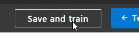
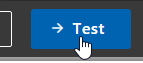

# Lab 1: Connect Bot to QnA Maker

## Abstract

In this lab, you will set up and run your first functional bot. It takes you beyond the basics by connecting your chat bot with a knowledge base deployed in Azure. Upon completion, developers should have:

* Installed the prerequisites to build a bot
* Learned the basics of a bot project
* Tested the bot using the Bot Framework Emulator
* Set up a knowledge base in Azure using the QnA Maker
* Tested the knowledge base on the QnA Maker website
* Exported and imported a knowledge base
* Integrated a bot application with the QnA Maker API

## Module 1: Set Up Tools

This module will walk you through the process of setting up the tools required to build and test your bot.

### Exercise 1: Install Visual Studio (Any Edition)

#### L1M1E1 Step 1

Navigate to https://visualstudio.microsoft.com/downloads/

#### L1M1E1 Step 2

Choose an edition of Visual Studio. For this lab, any edition will work.

#### L1M1E1 Step 3

The download installs the installer (not Visual Studio itself). When the installer starts, select “ASP.NET and web development”, “Azure development”, and “.NET Core cross-platform development”. Click “Install”

#### L1M1E1 Step 4

Wait

#### L1M1E1 Step 5

When it’s done, you’ll be asked to sign in. You can sign in or choose to do so later. Go ahead in sign in, because if you don’t do so now, you’ll have to do so in a few seconds.

### Exercise 2: Install Bot Framework Emulator

#### L1M1E2 Step 1

Close Visual Studio and the Visual Studio Installer

#### L1M1E2 Step 2

Navigate to https://github.com/Microsoft/BotFramework-Emulator/releases and install the latest version

### Exercise 3: Install Bot Framework Template for Visual Studio

#### L1M1E3 Step 1

Navigate to https://botbuilder.myget.org/gallery/aitemplates and choose the latest version of “Bot Builder SDK Template for Visual Studio”

#### L1M1E3 Step 2

Download and install

#### L1M1E3 Step 3

Start Visual Studio (you should not need to restart Windows)

## Module 2: Create new Echo Bot Project

In this module, you will create and run a bot using the predefined templates provided to Visual Studio.

### Exercise 1: Create Basic EchoBot

#### L1M2E1 Step 1

Create a new project

#### L1M2E1 Step 2

Create a new "Bot Builder Echo Bot V4" project

#### L1M2E1 Step 3

Start the project

### Exercise 2: Connect to EchoBot and Test It

#### L1M2E2 Step 1

Start the Bot Framework Emulator

#### L1M2E2 Step 2

Click "Open Bot"

#### L1M2E2 Step 3

Select the BotConfiguration.bot file in the project you just created

#### L1M2E2 Step 4

Type anything in the chat window. The EchoBot will respond by echoing back your message.

### Lab1 Module 2 Bonus Exercise 1

Work with a partner to identify where the turn is being processed. Modify the code to respond “Polo” when “Marco” is typed.

### Lab1 Module 2 Bonus Exercise 2

Look at how EchoBotAccessors.cs works. Modify it to save the user’s name if they type “My name is [name]”

### Lab1 Module 2 Bonus Exercise 3

Modify the bot to respond “Hello, it’s nice to meet you” when the user types “hello”, but only the first time the user types “hello”. Double bonus if you have it include the user's name if provided in the previous bonus exercise.

## Module 3: Create a Knowledge Base in Azure

In this module, you will learn how to create and configure a knowledge base using the Microsoft QnA Maker. You will also create a bot from a blank project and connect it to the QnA Maker API to provide interactive knowledge base functionality.

### Exercise 3: Create QnA Service

#### L1M3E1 Step 1

Navigate to https://www.qnamaker.ai

#### L1M3E1 Step 2

If you have not signed in, do so now.

#### L1M3E1 Step 3

Click "Create a knowledge base"

#### L1M3E1 Step 4

Create a QnA service in Azure

Image | Steps
--- | ---
 | <ol><li>Name the service</li><li>Choose a subscription (if you have more than one)</li><li>Choose the location of the service</li><li>Choose the tier (F0 is the free tier)</li><li>Choose an existing, or create a new resource group</li><li>Choose the Azure Search tier (F if the free tier)</li><li>Choose a location for the search service</li><li>Choose a globally unique name for the web application that will host the QnA service</li><li>Choose a location for the web application</li><li>Choose a location for Application Insights</li><li>Create the service</li></ol>

### Exercise 4: Create a Knowledge Base

#### L1M3E4 Step 1

Navigate to www.qnamaker.ai, and refresh the page. You should now be able to select the QnA service

#### L1M3E4 Step 2

Name your KB. For this exercise, any name will do

#### L1M3E4 Step 3

Skip "STEP 4". Click "Create your KB" in "STEP 5"

### Exercise 5: Add Questions and Answers to Knowledge Base

#### L1M3E5 Step 1

Click "Add QnA pair"

Image | Step
--- | ---
 | Under "Question", type "what is your name"
 | Under "Answer", type "My name is HAL9000"
 | Click "Save and train" at the top
 | Click "Test"
 | Chat with HAL9000. Notice how he respects variations in your question
 | Click "Inspect" to see how it interpreted your question
 | When you're done, click "Test" again to hide the panel

### Lab1 Module 3 Bonus Exercise 1

When inspecting the answer to “Do you have a name?” Have HAL9000 answer “Yes, I have a name. My friends call me HAL. You may call me HAL9000.”

### Lab1 Module 3 Bonus Exercise 2

Brainstorm with a partner to add alternative phrasings to the name question

### Lab1 Module 3 Bonus Exercise 3

Explore the Settings section of your KB. Export the knowledge base file and inspect it.

## Module 4: Connect a bot to the QnA App Service

In this module, we create a new QnA service and import a pre-configured file. We then will create a new bot project and connect it to the QnA service.

### Exercise 1: Import & Publish QnA

#### L1M4E1 Step 1

In QnA Maker (www.qnamaker.ai), click “Create a new knowledge base”

#### L1M4E1 Step 2

Select the options for "STEP 2"

#### L1M4E1 Step 3

Name the KB "HAL Bot 9000"

#### L1M4E1 Step 4

In "STEP 4", you can connect to a URL or upload a file during setup. We'll skip this step and connect after the KB is set up.

#### L1M4E1 Step 5

In "STEP 5", create the KB

#### L1M4E1 Step 6

Go to "Settings"

#### L1M4E1 Step 7

Add KB file by URL or file

**By File:**

Click "Add File" under "File Name"

If you pulled the lab content from GitHub, you can find the file in \labs\lab1\module4\models\HAL9000_QnA.tsv

Click "Save and train"

**By URL**

In the “URL” text box, paste the following URL: https://raw.githubusercontent.com/BlueMetal/BackMeUpBIAD/master/labs/lab1/module4/models/HAL9000_QnA.tsv

Click "Save and train"

#### L1M4E1 Step 8

Return to "EDIT" to see the questions and answers populated.

#### L1M4E1 Step 9

Click on "PUBLISH", then on the "Publish" button

### Exercise 2: Create and Prepare Project

#### 1M4E2 Step 1

Create a new "Bot Builder Echo Bot V4" project

#### 1M4E2 Step 2

Change the "Target Framework" to ".Net Core 2.1" in the project properties

> The current version of the libraries require .NET Core 2.1, so we must update this setting before updating libraries.

#### 1M4E2 Step 3

