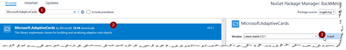

# Lab 2: Build Data Collection Flow & Adaptive Card

## Abstract

In this lab, we will manage a basic conversation using Dialogs. We’ll start with basic dialogs, demonstrating how dialogs are layered. We’ll finish off by using a WaterfallDialog to create a survey that connects to Azure Machine Learning to predict success in treatment for back pain.

Upon completion, developers should have:

* Manage conversations with dialogs
* Use accessors to persist dialog state between turns
* Validate dialog input
* Use prompts to to enrich dialogs
* Connect to machine learning
* Complete dialogs
* Enhance dialog experiences with adaptive cards

## Module 1: Add Dialog

### Exercise 1: Bootstrap Project

#### L2M1E1 Step 1

Navigate to https://github.com/BlueMetal/BackMeUpBIAD, Click on “Clone or download” and choose the option most appropriate to get the code.


#### L2M1E1 Step 2

Once you’ve pulled down the code, copy the “BackMeUp” folder from the path “\labs\lab2\start-here”. In the copy of the project, open BackMeUp.sln

#### L2M1E1 Step 3

Update all NuGet packages

#### L2M1E1 Step 4

Open BackMeUp.cs and replace the line

``` csharp
var responseMessage = "Placeholder";
```

with

``` csharp
var responseMessage = "Hello, World!";
```

#### L2M1E1 Step 5

Run the code and test it using the Bot Framework Emulator

### Exercise 2: Add a Simple Dialog

#### L2M1E2 Step 1

Add the Microsoft.Bot.Builder.Dialogs NuGet package


#### L2M1E2 Step 2

Create a “Dialogs” folder in the project and add the file DialogAccessors.cs to it. Paste the following code into the file

``` csharp
using Microsoft.Bot.Builder;
using Microsoft.Bot.Builder.Dialogs;

namespace BackMeUp.Dialogs
{
    public class DialogAccessors
    {
        public DialogAccessors(ConversationState conversationState)
        {
            ConversationState = conversationState;
        }

        public static string DialogStateName { get; } = $"{nameof(DialogAccessors)}.{nameof(DialogState)}";

        public IStatePropertyAccessor<DialogState> DialogState { get; set; }

        public ConversationState ConversationState { get; }
    }
}
```

#### L2M1E2 Step 3

Add CreateDialogAccessors method to Startup.cs

``` csharp
public DialogAccessors CreateDialogAccessors(IServiceProvider serviceProvider)
{
    var options = serviceProvider.GetRequiredService<IOptions<BotFrameworkOptions>>().Value;
    if (options == null)
    {
        throw new InvalidOperationException(
            "BotFrameworkOptions must be configured prior to setting up the state accessors");
    }

    var conversationState = options.State.OfType<ConversationState>().FirstOrDefault();
    if (conversationState == null)
    {
        throw new InvalidOperationException(
            "ConversationState must be defined and added before adding conversation-scoped state accessors.");
    }

    var accessors = new DialogAccessors(conversationState)
    {
        DialogState = conversationState.CreateProperty<DialogState>(DialogAccessors.DialogStateName),
    };

    return accessors;
}
```

#### L2M1E2 Step 4

Add the following line to the end of the ConfigureServices method in Startup.cs

``` csharp
services.AddSingleton(CreateDialogAccessors);
```

#### L2M1E2 Step 5

Add “DialogAccessors accessors” to the constructor signature of BackMeUp.cs, and capture it as a field “_accessors”

#### L2M1E2 Step 6

Add the field “private readonly DialogSet _dialogs;” to the BackMeUp.cs class

#### L2M1E2 Step 7

Add the following lines to the constructor

``` csharp
_dialogs = new DialogSet(_accessors.DialogState);
_dialogs.Add(new ConfirmPrompt("does-it-hurt"));
```

#### L2M1E2 Step 8

Replace the body of “OnTurnAsync” with the following code

``` csharp
if (turnContext.Activity.Type == ActivityTypes.Message)
{
    var dialogContext = await _dialogs.CreateContextAsync(turnContext, cancellationToken);
    var dialogStatus = DialogTurnStatus.Empty;
    if (dialogContext.Dialogs != null)
    {
        var results = await dialogContext.ContinueDialogAsync(cancellationToken);
        dialogStatus = results.Status;
    }

    // We are not in a dialog, so resume turns as normal
    if (dialogStatus == DialogTurnStatus.Empty)
    {
        var activityText = turnContext.Activity.Text.Trim().ToLowerInvariant();

        // start the dialog. We'll do better when we integrate LUIS
        if (new[] { "back pain", "start" }.Any(t => t == activityText))
        {
            // the prompt to show to the user when presenting them with the dialog
            var prompt = new PromptOptions
            {
                Prompt = MessageFactory.Text("Would you like to take a survey?"),
            };

            // Starts the dialog using the provided prompt
            var result = await dialogContext.PromptAsync("does-it-hurt", prompt, cancellationToken);
        }
        else
        {
            var responseMessage = MessageFactory.Text($"You said \"{turnContext.Activity.Text}\"");
            await turnContext.SendActivityAsync(responseMessage, cancellationToken);
        }
    }
}
else
{
    await turnContext.SendActivityAsync($"{turnContext.Activity.Type} event detected");
}
```

#### L2M1E2 Step 9

Run the code and test it. Type “back pain” at the prompt and see what happens. Ask your instructor or a partner before continuing if you don’t understand what is happening.

### Exercise 3: Add a Waterfall Dialog

#### L2M1E3 Step 1

Add a “BackPain” folder under the “Dialogs” folder

#### L2M1E3 Step 2

Add a class BackPainDialogFactory.cs with the following code

``` csharp
public class BackPainDialogFactory
{
    public const string DialogId = "back-pain";

    private readonly DialogAccessors _accessors;

    public BackPainDialogFactory(DialogAccessors accessors)
    {
        _accessors = accessors;
    }

    public Dialog Configure(DialogSet dialogSet)
    {
        RegisterPrompts(dialogSet);
        var steps = new WaterfallStep[]
        {
            ConfirmStartAsync,
            NextStepAsync,
        };
        var waterfallDialog = new WaterfallDialog(DialogId, steps);
        return waterfallDialog;
    }

    public async Task<DialogTurnResult> ConfirmStartAsync(
        WaterfallStepContext stepContext,
        CancellationToken cancellationToken)
    {
        // Provides a disclaimer about privacy and prompts the user to agree before continuing
        await stepContext.Context.SendActivityAsync(
            MessageFactory.Text(
                @"I'm about to ask you some questions to try to determine a course of care for your back pain.
Some of the questions will be very personal. While we do use the information you provide to improve our ability to help future patients, we will never try to identify individuals or share individual data with anyone."),
            cancellationToken);
        await Task.Delay(500, cancellationToken); // half-second between messages feels a little more natural
        await stepContext.Context.SendActivityAsync(MessageFactory.Text("We value your privacy above all other concerns."), cancellationToken);

        return await stepContext.PromptAsync(Prompts.ConfirmStart, new PromptOptions { Prompt = MessageFactory.Text("Do you wish to proceed?") }, cancellationToken);
    }

    public async Task<DialogTurnResult> NextStepAsync(
        WaterfallStepContext stepContext,
        CancellationToken cancellationToken)
    {
        var result = (bool)stepContext.Result;
        if (result)
        {
            await stepContext.Context.SendActivityAsync(
                MessageFactory.Text("Great. Let's get started!"),
                cancellationToken);
        }
        else
        {
            await stepContext.Context.SendActivityAsync(
                MessageFactory.Text("Okay, I understand."),
                cancellationToken);
        }

        return await stepContext.EndDialogAsync(cancellationToken: cancellationToken);
    }

    private void RegisterPrompts(DialogSet dialogSet)
    {
        dialogSet.Add(new ConfirmPrompt(Prompts.ConfirmStart));
    }

    private static class Prompts
    {
        public const string ConfirmStart = DialogId + "_confrim-start";
    }
}
```

#### L2M1E3 Step 3

Run the solution, and test in Bot Framework Emulator

## Module 2: Stateful Waterfall Dialog

### Exercise 1: Add State Object and Capture State

#### L2M2E1 Step 1

Under “Dialogs\BackPain”, create a file “BackPainDemographics.cs”. Add the following code

``` csharp
public class BackPainDemographics
{
    public string Age { get; set; }

    public string BiologicalSex { get; set; }

    public string CancerHistory { get; set; }

    public string PsychiatricCare { get; set; }

    public string HadPhysicalTherapy { get; set; }

    public string CognitiveBehavioralTherapy { get; set; }

    public string PreviousBackSurgery { get; set; }

    public string Fever { get; set; }

    public string FecalIncontinence { get; set; }

    public string OpioidUse { get; set; }

    public string LevelOfPain { get; set; }

    public string Race { get; set; }
}
```

#### L2M2E1 Step 2

In “DialogAccessors.cs”, add the following code

``` csharp
public static string BackPainDemographicsName { get; } = $"{nameof(DialogAccessors)}.{nameof(BackPainDemographics)}";
public IStatePropertyAccessor<BackPainDemographics> BackPainDemographics { get; set; }
```

#### L2M2E1 Step 3

In “Startup.cs”, find the code that initializes the DialogAccessors class, replace it with the following

```csharp
var accessors = new DialogAccessors(conversationState)
{
    DialogState = conversationState.CreateProperty<DialogState>(DialogAccessors.DialogStateName),
    BackPainDemographics = conversationState.CreateProperty<BackPainDemographics>(DialogAccessors.BackPainDemographicsName),
};
```

#### L2M2E1 Step 4

In “BackPainDialogFactory.cs”

1. Add the following to the “Prompts” static class

``` csharp
public const string Age = DialogId + "_age";
```

2. Add the following to the “RegisterPrompts” method

``` csharp
dialogSet.Add(new NumberPrompt<int>(Prompts.Age));
```

3. Remove the method “NextStepAsync” and replace it with the following code

``` csharp
public async Task<DialogTurnResult> PromptForAgeAsync(
    WaterfallStepContext stepContext,
    CancellationToken cancellationToken)
{
    // If the user answered "yes", then we'll continue
    var proceed = (bool)stepContext.Result;
    if (proceed)
    {
        await stepContext.Context.SendActivityAsync(
            MessageFactory.Text("Okay. Let's get started."),
            cancellationToken);
        await Task.Delay(500, cancellationToken);
    }
    else
    {
        // user answered "no".
        await stepContext.Context.SendActivityAsync(
            MessageFactory.Text("I understand. I hope you feel better."),
            cancellationToken);
        return await stepContext.EndDialogAsync(cancellationToken: cancellationToken);
    }

    return await stepContext.PromptAsync(
        Prompts.Age,
        new PromptOptions
        {
            Prompt = MessageFactory.Text("How old are you?"),
        },
        cancellationToken);
}

public async Task<DialogTurnResult> NextStepAsync(
    WaterfallStepContext stepContext,
    CancellationToken cancellationToken)
{
    // get the age from the last prompt
    var result = (int)stepContext.Result;

    // get the state (or create it if it is new)
    var state = await _accessors.BackPainDemographics.GetAsync(
        stepContext.Context,
        () => new BackPainDemographics(),
        cancellationToken);

    // set the age in the state object
    state.Age = result.ToString(CultureInfo.InvariantCulture);

    // for now, we're going to end this step without a prompt so we can see the state persistence
    // at work in the next step
    return await stepContext.NextAsync(cancellationToken: cancellationToken);
}

public async Task<DialogTurnResult> FinalStepAsync(
    WaterfallStepContext stepContext,
    CancellationToken cancellationToken)
{
    var state = await _accessors.BackPainDemographics.GetAsync(
        stepContext.Context,
        () => new BackPainDemographics(),
        cancellationToken);

    // reflect the user's age back. This is retrieved from state
    await stepContext.Context.SendActivityAsync(MessageFactory.Text($"Your age is {state.Age}"), cancellationToken);
    return await stepContext.EndDialogAsync(cancellationToken: cancellationToken);
}
```

4. In the method “Configure”, replace the code that initializes “steps” with the following

``` csharp
var steps = new WaterfallStep[]
{
    ConfirmStartAsync,
    PromptForAgeAsync,
    NextStepAsync,
    FinalStepAsync,
};
```

#### L2M2E1 Step 5

Run the code and test it in Bot Framework Emulator

### Exercise 2: Validate Dialog Input

#### L2M2E2 Step 1

In “BackPainDialogFactory.cs” add the following method

``` csharp
private async Task<bool> ValidateAgeAsync(PromptValidatorContext<int> context, CancellationToken cancellationToken)
{
    // Validates the age provided by the user. This will prevent invalid data.
    var value = context.Recognized.Value;
    if (value <= 0)
    {
        await context.Context.SendActivityAsync(
            MessageFactory.Text("You must be older than zero years old."),
            cancellationToken);
        return false;
    }

    // if the user is older than 120, make the age -1. This will cause them to exit out on the next step.
    if (value <= 120)
    {
        return true;
    }

    await context.Context.SendActivityAsync(
        MessageFactory.Text($"Congratulations for making it to {value} years of age. Unfortunately, our data set doesn't have the data necessary to help you."),
        cancellationToken);
    context.Recognized.Value = -1;

    return true;
}
```

#### L2M2E2 Step 2

In “NextStepAsync”, replace the first line of code with the following

``` csharp
// get the age from the last prompt
var result = (int)stepContext.Result;

if (result < 0)
{
    return await stepContext.EndDialogAsync(cancellationToken: cancellationToken);
}
```

#### L2M2E2 Step 3

Replace the Age prompt in “RegisterPrompts” with the following

``` csharp
dialogSet.Add(new NumberPrompt<int>(Prompts.Age, ValidateAgeAsync));
```

#### L2M2E2 Step 4

Run your code and test it in Bot Framework Emulator. Try entering an age of 0 or above 120.

### Exercise 3: Finish Collecting Data

#### L2M2E3 Step 1

In the folder “Dialogs\BackPain” add a class BackPainTranslations.cs. Use the following code

``` csharp
public static class BackPainTranslations
{
    public static string YesNo(bool eval)
    {
        return eval ? "yes" : "no";
    }

    public static readonly List<Choice> PainLevelOptions = new[] { 1, 2, 3, 4, 5, 6, 7, 8, 9, 10 }.Select(x => new Choice(x.ToString())).ToList();

    public static IDictionary<string, (string code, Choice choice)> BiologicalSexes => new Dictionary<string, (string code, Choice choice)>
    {
        {
            "Unspecified", ("unspecified", new Choice("Unspecified"))
        },
        {
            "Intersex", ("intersex", new Choice("Intersex"))
        },
        {
            "Female", ("female", new Choice("Female")
            {
                Synonyms = new List<string> { "Woman", "Girl" },
            })
        },
        {
            "Male", ("male", new Choice("Male")
            {
                Synonyms = new List<string> { "Man", "Boy" },
            })
        },
    };

    public static IDictionary<string, (string code, Choice choice)> Races => new Dictionary<string, (string code, Choice choice)>
    {
        {
            "African American", ("B", new Choice("African American")
            {
                Synonyms = new List<string> { "Black" },
            })
        },
        {
            "Caucasian", ("W", new Choice("Caucasian")
            {
                Synonyms = new List<string> { "White" },
            })
        },
        {
            "Asian", ("A", new Choice("Asian"))
        },
        {
            "Hispanic", ("H", new Choice("Hispanic")
            {
                Synonyms = new List<string> { "Latino", "Latina", "Mexican", "Mexican American" },
            })
        },
        {
            "Other", ("U", new Choice("Other"))
        },
    };
}
```

#### L2M2E3 Step 2

In the file “BackPainDialogFactory.cs”, replace the contents of the subclass “Prompts” with the following

``` csharp
public const string ConfirmStart = DialogId + "_confrim-start";
public const string Age = DialogId + "_age";
public const string BiologicalSex = DialogId + "_biological-sex";
public const string CancerHistory = DialogId + "_cancer-history";
public const string PsychCareHistory = DialogId + "_psych-care-history";
public const string PhysicalTherapyHistory = DialogId + "_physical-therapy-history";
public const string CognitiveBehavioralTherapyHistory = DialogId + "_cognitive-behavioral-therapy-history";
public const string PreviousBackSurgeryHistory = DialogId + "_previous-back-surgery-history";
public const string FeverHistory = DialogId + "_fever-history";
public const string FecalIncontinenceHistory = DialogId + "_fecal-incontinence-history";
public const string OpioidUse = DialogId + "_opioid-use";
public const string LevelOfPain = DialogId + "_level-of-pain";
public const string Race = DialogId + "_race";
```

#### L2M2E3 Step 3

In the file “BackPainDialogFactory.cs”, replace the contents of the method “RegisterPrompts” with the following

``` csharp
dialogSet
    .Add(new ConfirmPrompt(Prompts.ConfirmStart))
    .Add(new NumberPrompt<int>(Prompts.Age, ValidateAgeAsync))
    .Add(new ChoicePrompt(Prompts.BiologicalSex))
    .Add(new ConfirmPrompt(Prompts.CancerHistory))
    .Add(new ConfirmPrompt(Prompts.PsychCareHistory))
    .Add(new ConfirmPrompt(Prompts.PhysicalTherapyHistory))
    .Add(new ConfirmPrompt(Prompts.CognitiveBehavioralTherapyHistory))
    .Add(new ConfirmPrompt(Prompts.PreviousBackSurgeryHistory))
    .Add(new ConfirmPrompt(Prompts.FeverHistory))
    .Add(new ConfirmPrompt(Prompts.FecalIncontinenceHistory))
    .Add(new ConfirmPrompt(Prompts.OpioidUse))
    .Add(new ChoicePrompt(Prompts.LevelOfPain))
    .Add(new ChoicePrompt(Prompts.Race));
```

#### L2M2E3 Step 4

In the file “BackPainDialogFactory.cs”, delete the methods “NextStepAsync” and “FinalStepAsync” with the following

``` csharp
private async Task<DialogTurnResult> PromptForBiologicalSexAsync(
    WaterfallStepContext stepContext,
    CancellationToken cancellationToken)
{
    var demographics = await _accessors.BackPainDemographics.GetAsync(
        stepContext.Context,
        () => new BackPainDemographics(),
        cancellationToken);

    var age = (int)stepContext.Result;

    // if they were identified as too old during the age validation, we end the dialog here.
    if (age == -1)
    {
        return await stepContext.EndDialogAsync(cancellationToken: cancellationToken);
    }

    demographics.Age = age.ToString();

    return await stepContext.PromptAsync(
        Prompts.BiologicalSex,
        new PromptOptions
        {
            Prompt = MessageFactory.Text("Which option most closely approximates your biological sex."),
            Choices = BackPainTranslations.BiologicalSexes.Select(kv => kv.Value.choice).ToList(),
        },
        cancellationToken);
}

private async Task<DialogTurnResult> PromptForCancerHistoryAsync(
    WaterfallStepContext stepContext,
    CancellationToken cancellationToken)
{
    var demographics = await _accessors.BackPainDemographics.GetAsync(
        stepContext.Context,
        () => new BackPainDemographics(),
        cancellationToken);
    demographics.BiologicalSex = BackPainTranslations
        .BiologicalSexes[((FoundChoice)stepContext.Result).Value]
        .code;
    return await stepContext.PromptAsync(
        Prompts.CancerHistory,
        new PromptOptions
        {
            Prompt = MessageFactory.Text("Have you ever had cancer?"),
        },
        cancellationToken);
}

private async Task<DialogTurnResult> PromptForPsychCareHistoryAsync(
    WaterfallStepContext stepContext,
    CancellationToken cancellationToken)
{
    var demographics = await _accessors.BackPainDemographics.GetAsync(
        stepContext.Context,
        () => new BackPainDemographics(),
        cancellationToken);
    demographics.CancerHistory = BackPainTranslations.YesNo((bool)stepContext.Result);
    return await stepContext.PromptAsync(
        Prompts.PsychCareHistory,
        new PromptOptions
        {
            Prompt = MessageFactory.Text("Have you ever received psychiatric care?"),
        },
        cancellationToken);
}

private async Task<DialogTurnResult> PromptForPhysicalTherapyHistoryAsync(
    WaterfallStepContext stepContext,
    CancellationToken cancellationToken)
{
    var demographics = await _accessors.BackPainDemographics.GetAsync(
        stepContext.Context,
        () => new BackPainDemographics(),
        cancellationToken);
    var psychiatricCare = (bool)stepContext.Result;
    demographics.PsychiatricCare = BackPainTranslations.YesNo(psychiatricCare);
    if (psychiatricCare)
    {
        await stepContext.Context.SendActivityAsync(MessageFactory.Text("I know that can be hard to admit some times, but sharing that information will definitely help us with the diagnosis."), cancellationToken);
        await Task.Delay(150, cancellationToken);
    }

    return await stepContext.PromptAsync(
        Prompts.PhysicalTherapyHistory,
        new PromptOptions
        {
            Prompt = MessageFactory.Text("Have you ever had physical therapy?"),
        },
        cancellationToken);
}

private async Task<DialogTurnResult> PromptForCognitiveBehavioralTherapyHistoryAsync(
    WaterfallStepContext stepContext,
    CancellationToken cancellationToken)
{
    var demographics = await _accessors.BackPainDemographics.GetAsync(
        stepContext.Context,
        () => new BackPainDemographics(),
        cancellationToken);
    demographics.HadPhysicalTherapy = BackPainTranslations.YesNo((bool)stepContext.Result);
    return await stepContext.PromptAsync(
        Prompts.CognitiveBehavioralTherapyHistory,
        new PromptOptions
        {
            Prompt = MessageFactory.Text("Have you ever had cognitive behavioral therapy?"),
        },
        cancellationToken);
}

private async Task<DialogTurnResult> PromptForPreviousBackSurgeryHistoryAsync(
    WaterfallStepContext stepContext,
    CancellationToken cancellationToken)
{
    var demographics = await _accessors.BackPainDemographics.GetAsync(
        stepContext.Context,
        () => new BackPainDemographics(),
        cancellationToken);
    demographics.CognitiveBehavioralTherapy = BackPainTranslations.YesNo((bool)stepContext.Result);
    return await stepContext.PromptAsync(
        Prompts.PreviousBackSurgeryHistory,
        new PromptOptions
        {
            Prompt = MessageFactory.Text("Have you had back surgery before?"),
        },
        cancellationToken);
}

private async Task<DialogTurnResult> PromptForFeverHistoryAsync(
    WaterfallStepContext stepContext,
    CancellationToken cancellationToken)
{
    var demographics = await _accessors.BackPainDemographics.GetAsync(
        stepContext.Context,
        () => new BackPainDemographics(),
        cancellationToken);
    demographics.PreviousBackSurgery = BackPainTranslations.YesNo((bool)stepContext.Result);
    return await stepContext.PromptAsync(
        Prompts.FeverHistory,
        new PromptOptions
        {
            Prompt = MessageFactory.Text("Is or was your back pain associated with fever?"),
        },
        cancellationToken);
}

private async Task<DialogTurnResult> PromptForFecalIncontinenceHistoryAsync(
    WaterfallStepContext stepContext,
    CancellationToken cancellationToken)
{
    var demographics = await _accessors.BackPainDemographics.GetAsync(
        stepContext.Context,
        () => new BackPainDemographics(),
        cancellationToken);
    demographics.Fever = BackPainTranslations.YesNo((bool)stepContext.Result);
    return await stepContext.PromptAsync(
        Prompts.FecalIncontinenceHistory,
        new PromptOptions
        {
            Prompt = MessageFactory.Text("I know the next question stinks, but I have to ask. Have you suffered from fecal incontinence in association with your back pain?"),
        },
        cancellationToken);
}

private async Task<DialogTurnResult> PromptForOpioidUseAsync(
    WaterfallStepContext stepContext,
    CancellationToken cancellationToken)
{
    var demographics = await _accessors.BackPainDemographics.GetAsync(
        stepContext.Context,
        () => new BackPainDemographics(),
        cancellationToken);
    demographics.FecalIncontinence = BackPainTranslations.YesNo((bool)stepContext.Result);
    return await stepContext.PromptAsync(
        Prompts.OpioidUse,
        new PromptOptions
        {
            Prompt = MessageFactory.Text("Are you, or have you recently been an opioid user?"),
        },
        cancellationToken);
}

private async Task<DialogTurnResult> PromptForLevelOfPainAsync(
    WaterfallStepContext stepContext,
    CancellationToken cancellationToken)
{
    var demographics = await _accessors.BackPainDemographics.GetAsync(
        stepContext.Context,
        () => new BackPainDemographics(),
        cancellationToken);
    demographics.OpioidUse = BackPainTranslations.YesNo((bool)stepContext.Result);
    return await stepContext.PromptAsync(
        Prompts.LevelOfPain,
        new PromptOptions
    {
        Prompt = MessageFactory.Text("How much pain are you in (1 is lowest, 10 is highest)?"),
        Choices = BackPainTranslations.PainLevelOptions,
    },
        cancellationToken);
}

private async Task<DialogTurnResult> PromptForRaceStepAsync(
    WaterfallStepContext stepContext,
    CancellationToken cancellationToken)
{
    BackPainDemographics demographics = await _accessors.BackPainDemographics.GetAsync(
        stepContext.Context,
        () => new BackPainDemographics(),
        cancellationToken);
    FoundChoice choice = (FoundChoice)stepContext.Result;
    demographics.LevelOfPain = choice.Value;
    return await stepContext.PromptAsync(
        Prompts.Race,
        new PromptOptions
        {
            Prompt = MessageFactory.Text("What is your race?"),
            Choices = BackPainTranslations.Races.Select(kv => kv.Value.choice).ToList(),
        }, cancellationToken);
}

private async Task<DialogTurnResult> SummaryAsync(
    WaterfallStepContext stepContext,
    CancellationToken cancellationToken)
{
    var state = await _accessors.BackPainDemographics.GetAsync(
        stepContext.Context,
        () => new BackPainDemographics(),
        cancellationToken);
    var race = (FoundChoice)stepContext.Result;
    state.Race = BackPainTranslations.Races[race.Value].code;

    // reflect the user's answers back. This is retrieved from state
    var serialized = JsonConvert.SerializeObject(state);
    await stepContext.Context.SendActivityAsync(MessageFactory.Text(serialized), cancellationToken);
    return await stepContext.EndDialogAsync(cancellationToken: cancellationToken);
}
```

#### L2M2E3 Step 5

In the file “BackPainDialogFactory.cs”, replace the contents of the method “Configure” with the following

``` csharp
RegisterPrompts(dialogSet);
var steps = new WaterfallStep[]
{
    ConfirmStartAsync,
    PromptForAgeAsync,
    PromptForBiologicalSexAsync,
    PromptForCancerHistoryAsync,
    PromptForPsychCareHistoryAsync,
    PromptForPhysicalTherapyHistoryAsync,
    PromptForCognitiveBehavioralTherapyHistoryAsync,
    PromptForPreviousBackSurgeryHistoryAsync,
    PromptForFeverHistoryAsync,
    PromptForFecalIncontinenceHistoryAsync,
    PromptForOpioidUseAsync,
    PromptForLevelOfPainAsync,
    PromptForRaceStepAsync,
    SummaryAsync,
};
var waterfallDialog = new WaterfallDialog(DialogId, steps);
return waterfallDialog;
```

#### L2M2E3 Step 6

Run the code and test it using the Bot Framework Emulator. Try various combinations of answers.

### Exercise 4: Display Adaptive Card

#### L2M2E4 Step 1

Add the AdaptiveCards NuGet package to the project (Microsoft.AdaptiveCards)



#### L2M2E4 Step 2

Add the following code to the “ConfigureServices” method of “Startup.cs”

``` csharp
// This gives us access to the HTTP context. We can use this to determine the host address
services.AddSingleton<IHttpContextAccessor, HttpContextAccessor>();
```

#### L2M2E4 Step 3

Add the following extension method to “BackPainTranslations.cs”

``` csharp
public static List<Fact> ToFactList(this BackPainDemographics source)
{
    var race = Races.Single(r => r.Value.code == source.Race).Key;

    return new List<Fact>
    {
        new Fact("Age", source.Age, $"<s>age</s> {source.Age}"),
        new Fact("Biological Sex", source.BiologicalSex, $"<s>biological sex</s> {source.BiologicalSex}"),
        new Fact("History of Cancer", source.CancerHistory, $"<s>cancer history</s> {source.CancerHistory}"),
        new Fact("Psychiatric Care", source.PsychiatricCare, $"<s>psychiatric care</s> {source.PsychiatricCare}"),
        new Fact("Physical Therapy", source.HadPhysicalTherapy, $"<s>physical therapy</s> {source.HadPhysicalTherapy}"),
        new Fact("Cognitive Behavioral Therapy", source.CognitiveBehavioralTherapy, $"<s>cognitive behavioral therapy</s> {source.CognitiveBehavioralTherapy}"),
        new Fact("Back Surgery", source.PreviousBackSurgery, $"<s>back surgery</s> {source.PreviousBackSurgery}"),
        new Fact("Fever", source.Fever, $"<s>fever</s> {source.Fever}"),
        new Fact("Fecal Incontinence", source.FecalIncontinence, $"<s>fecal incontinence</s> {source.FecalIncontinence}"),
        new Fact("Opioid Use", source.OpioidUse, $"<s>opioid use</s> {source.OpioidUse}"),
        new Fact("Pain Level", source.LevelOfPain, $"<s>pain level</s> {source.LevelOfPain}"),
        new Fact("Race", race, $"<s>race</s> {race}"),
    };
}
```

#### L2M2E4 Step 4

Changes to the BackPainDialogFactory.cs file

1. Add `IHttpContextAccessor httpAccessor` to the constructor
2. Add a field `private readonly string _hostAddress;`
3. Add the following code to the constructor body

``` csharp
var request = httpAccessor.HttpContext.Request;
_hostAddress = $"{request.Scheme}://{request.Host}";
```

4. Add the following method

``` csharp
private async Task DisplaySummaryAsync(WaterfallStepContext stepContext, BackPainDemographics demographics, CancellationToken cancellationToken)
{
    var card = new AdaptiveCard
    {
        Speak = "<s>Submission Summary</s>. Please review for accuracy.",
        Body = new List<CardElement>
        {
            new TextBlock
            {
                Text = "Submission Summary",
                Size = TextSize.Large,
                Weight = TextWeight.Bolder,
            },
            new TextBlock
            {
                Text = "Please review for accuracy.",
            },
            new ColumnSet
            {
                Columns = new List<Column>
                {
                    new Column
                    {
                        Items = new List<CardElement>
                        {
                            new Image
                            {
                                Url = $"{_hostAddress}/images/check-mark.png",
                                AltText = "check mark",
                                Size = ImageSize.Medium,
                            },
                        },
                        Size = ColumnSize.Auto,
                    },
                    new Column
                    {
                        Items = new List<CardElement>
                        {
                            new FactSet
                            {
                                Facts = demographics.ToFactList(),
                            },
                        },
                        Size = ColumnSize.Stretch,
                    },
                },
            },
        },
    };

    var attachment = new Attachment
    {
        ContentType = AdaptiveCard.ContentType,
        Content = card,
    };
    await stepContext.Context.SendActivityAsync(MessageFactory.Attachment(attachment), cancellationToken);
}
```

5. Replace the contents of SummaryAsync with the following code

``` csharp
var demographics = await _accessors.BackPainDemographics.GetAsync(
    stepContext.Context,
    () => new BackPainDemographics(),
    cancellationToken);
var race = (FoundChoice)stepContext.Result;
demographics.Race = BackPainTranslations.Races[race.Value].code;

await DisplaySummaryAsync(stepContext, demographics, cancellationToken);

return await stepContext.EndDialogAsync(cancellationToken: cancellationToken);
```

#### L2M2E4 Step 5

Run the code and test it using the Bot Framework Emulator

### Exercise 5: Add Action to Card

#### L2M2E5 Step 1

Add a folder “Messages” to the project. Add the following two files:

1. PostBackData.cs

``` csharp
public class PostBackData<T>
{
    public PostBackData(string actionType, T data)
        => (ActionType, Data) = (actionType, data);

    public string ActionType { get; set; }

    public T Data { get; set; }
}
```

2. PostBackActions.cs

``` csharp
public static class PostBackActions
{
    public const string Default = "do-nothing";
    public const string SubmitBackPainData = "back-pain_continue";
    public const string StartBackPainSurvey = "back-pain_start";
}
```

#### L2M2E5 Step 2

Add the following static property to “BackPainTranslations.cs”

``` csharp
public static readonly List<Choice> ConfirmCompleteChoices = new List<Choice>
{
    new Choice("Continue")
    {
        Synonyms = new List<string> { "yes", "confirm", "affirmative" },
    },
    new Choice("Start Over")
    {
        Synonyms = new List<string> { "retry" },
    },
    new Choice("Cancel")
    {
        Synonyms = new List<string> { "quit", "exit", "bye" },
    },
};
```

#### L2M2E5 Step 3

In “DisplaySummaryAsync” in “BackPainDialogFactory.cs”, add the following “Actions” definition to the AdaptiveCard initializer.

``` csharp
Actions = new List<ActionBase>
{
    new SubmitAction
    {
        Title = "Continue",
        Data = new PostBackData<BackPainDemographics>(PostBackActions.SubmitBackPainData, demographics),
    },
    new SubmitAction
    {
        Title = "Start Over",
        Data = new PostBackData<string>(PostBackActions.StartBackPainSurvey, string.Empty),
    },
    new SubmitAction
    {
        Title = "Cancel",
        Data = new PostBackData<string>(PostBackActions.Default, string.Empty),
    },
},
```

#### L2M2E5 Step 4

In  the “OnTurnAsync” method of “BackMeUp.cs”, replace the lines

``` csharp
var activityText = turnContext.Activity.Text.Trim().ToLowerInvariant();

// start the dialog. We'll do better when we integrate LUIS
if (new[] { "back pain", "start" }.Any(t => t == activityText))
```

in “BackMeUp.OnTurnAsync” with the following

``` csharp
var activityText = turnContext.Activity.Text?.Trim()?.ToLowerInvariant();

if (activityText == null)
{
    var jsonData = turnContext.Activity.Value as JObject;
    var postBackAction = jsonData?.GetValue("ActionType")?.Value<string>();
    if (postBackAction == null)
    {
        return;
    }

    switch (postBackAction)
    {
        case PostBackActions.StartBackPainSurvey:
            await dialogContext.BeginDialogAsync(
                BackPainDialogFactory.DialogId,
                cancellationToken: cancellationToken);
            break;
        case PostBackActions.SubmitBackPainData:
            var backPainDemographics = jsonData["Data"].ToObject<BackPainDemographics>();
            // todo we're doing this in Module 3
            Debugger.Break();
            break;
        case PostBackActions.Default:
            break;
        default:
            throw new InvalidOperationException($"The PostBack action type {postBackAction} was not recognized.");
    }
}
else if (new[] { "back pain", "start" }.Any(t => t == activityText))
```

#### L2M2E5 Step 5

Run the code and test it in Bot Framework Emulator

## Module 3: Azure Machine Learning

### Exercise 1: Call Azure Machine Learning

#### L2M3E1 Step 1

Add the following static property to “BackPainTranslations.cs”

``` csharp
public static readonly Dictionary<string, string> Treatments = new Dictionary<string, string>
{
    { "22554", "Anterior Interbody Fusion" },
    { "22524", "Percutaneous Vertebral Augmentation" },
    { "97111", "Physical Therapy" },
    { "97110", "OTC Rx" },
    { "76910", "Epidural" },
    { "76911", "Physiatry" },
    { "63030", "Posterior Lamina Removal with Decomp" },
};
```

#### L2M3E1 Step 2

Create a folder “AzureML”

#### L2M3E1 Step 3

Under “AzureML”, create another folder “Models”. Add the following files

1. DoubleConverter.cs

``` csharp
public class DoubleConverter : JsonConverter
{
    public override bool CanConvert(Type objectType)
    {
        // name used in a previous answer
        if (objectType == typeof(double))
        {
            return true;
        }

        return false;
    }

    public override object ReadJson(
        JsonReader reader,
        Type objectType,
        object existingValue,
        JsonSerializer serializer)
    {
        var token = JToken.Load(reader);
        double.TryParse(token.ToString(), out var d);
        return d;
    }

    public override void WriteJson(
        JsonWriter writer,
        object value,
        JsonSerializer serializer)
    {
        throw new NotImplementedException();
    }
}
```

2. SortOrderConverter.cs

``` csharp
public class SortOrderConverter : JsonConverter
{
    public override bool CanConvert(Type objectType)
    {
        return (objectType == typeof(int));
    }

    public override object ReadJson(JsonReader reader, Type objectType, object existingValue, JsonSerializer serializer)
    {
        var token = JToken.Load(reader);
        switch (token.ToString())
        {
            case "Day1_Success":
                return 0;
            case "Week1_Success":
                return 1;
            case "Month3_Success":
                return 2;
            case "Day1_Unsuccessful":
                return 3;
            case "Week1_Unsuccessful":
                return 4;
            case "Month3_Unsuccessful":
                return 5;
            case "Day1_Repeat_Surgery":
                return 6;
            case "Week1_Repeat_Surgery":
                return 7;
            case "Month3_Repeat_Surgery":
                return 8;
            case "Long_Term_Pain_Mngmnt":
                return 9;
            default:
                throw new InvalidCastException($"The value \"{token.ToString()}\" is not recognized");
        }
    }

    public override void WriteJson(JsonWriter writer, object value, JsonSerializer serializer)
    {
        throw new NotImplementedException();
    }
}
```

3. MachineLearningData.cs

``` csharp
public class MachineLearningData
{
    public string ID { get; set; }
    public string Diagnosis { get; set; }
    public string Spinal_Canal_Stenosis { get; set; }
    public string Neural_Foraminal_Narrowing { get; set; }
    public string Disc { get; set; }
    public string Annular_Tear { get; set; }
    public string Ligamentum_Flavum { get; set; }
    public string Facet_Arthropathy { get; set; }
    public string Synovial_Cyst_mm { get; set; }
    public string Perineurial_Cyst_mm { get; set; }
    public string Tarlov_Cyst_mm { get; set; }
    public string Sponylolysis { get; set; }
    public string Spondyolithesis { get; set; }
    public string Anterolithesis { get; set; }
    public string Retrolisthesis { get; set; }
    public string Compression { get; set; }
    public string Pain_Chronicity { get; set; }
    public string Pain_Severity { get; set; }
    public string Radiculopathy { get; set; }
    public string Cancer_History { get; set; }
    public string Spinal_Infect_Hist { get; set; }
    public string Cauda_Equina { get; set; }
    public string Neurologic_Deficits { get; set; }
    public string Osteoporosis { get; set; }
    public string Osteopenia { get; set; }
    public string Prev_PT { get; set; }
    public string Prev_CBT { get; set; }
    public string Prev_Exercise_Thera { get; set; }
    public string Prev_Pharma_Thera { get; set; }
    public string Prev_Surgical_Thera { get; set; }
    public string Unexplained_Wt_Loss { get; set; }
    public string Fever { get; set; }
    public string IVDU { get; set; }
    public string Recent_Infection { get; set; }
    public string Urinary_Retention { get; set; }
    public string Fecal_Incontinence { get; set; }
    public string Saddle_Anesthesia { get; set; }
    public string Use_Corticosterioids { get; set; }
    public string Management_Plan { get; set; }
    public string Opioid_Use { get; set; }
    public string Psychiatric_History { get; set; }
    public string PCP { get; set; }
    public string Self_Referral { get; set; }
    public string Gender { get; set; }
    public string Age { get; set; }
    public string Height_in { get; set; }
    public string Weight_lbs { get; set; }
    public string BMI { get; set; }
    public string Race { get; set; }
    public string National_Origin { get; set; }
    public string Marital_Status { get; set; }
    public string Income_Level { get; set; }
    public string Zip_Code { get; set; }
    public string Education { get; set; }
    public string Encounter_Date { get; set; }
    public string Prior_Surgery { get; set; }
    public string Acute_Chronic { get; set; }
    public string Overall_Health { get; set; }
    public string Activity_Level { get; set; }
    public string Sport { get; set; }
    public string Employment_Activity { get; set; }
    public string TV_Hours_Per_Day { get; set; }
    public string Treatment { get; set; }
    public string Outcome { get; set; }

    [JsonProperty(PropertyName = "Scored Probabilities for Class \"Day1_Repeat_Surgery\"")]
    [JsonConverter(typeof(DoubleConverter))]
    public double? Day1RepeatSurgery { get; set; }
    [JsonProperty(PropertyName = "Scored Probabilities for Class \"Day1_Success\"")]
    [JsonConverter(typeof(DoubleConverter))]
    public double? Day1Success { get; set; }
    [JsonProperty(PropertyName = "Scored Probabilities for Class \"Day1_Unsuccessful\"")]
    [JsonConverter(typeof(DoubleConverter))]
    public double? Day1Unsuccessful { get; set; }
    [JsonProperty(PropertyName = "Scored Probabilities for Class \"Long_Term_Pain_Mngmnt\"")]
    [JsonConverter(typeof(DoubleConverter))]
    public double? LongTermPainManagement { get; set; }
    [JsonProperty(PropertyName = "Scored Probabilities for Class \"Month3_Repeat_Surgery\"")]
    [JsonConverter(typeof(DoubleConverter))]
    public double? Month3RepeatSurgery { get; set; }
    [JsonProperty(PropertyName = "Scored Probabilities for Class \"Month3_Success\"")]
    [JsonConverter(typeof(DoubleConverter))]
    public double? Month3Success { get; set; }
    [JsonProperty(PropertyName = "Scored Probabilities for Class \"Month3_Unsuccessful\"")]
    [JsonConverter(typeof(DoubleConverter))]
    public double? Month3Unsuccessful { get; set; }
    [JsonProperty(PropertyName = "Scored Probabilities for Class \"Week1_Repeat_Surgery\"")]
    [JsonConverter(typeof(DoubleConverter))]
    public double? Week1RepeatSurgery { get; set; }
    [JsonProperty(PropertyName = "Scored Probabilities for Class \"Week1_Success\"")]
    [JsonConverter(typeof(DoubleConverter))]
    public double? Week1Success { get; set; }
    [JsonProperty(PropertyName = "Scored Probabilities for Class \"Week1_Unsuccessful\"")]
    [JsonConverter(typeof(DoubleConverter))]
    public double? Week1Unsuccessful { get; set; }
    [JsonProperty(PropertyName = "Scored Labels")]
    [JsonConverter(typeof(SortOrderConverter))]
    public int ResultStrength { get; set; }
}
```

4. Results.cs

``` csharp
public class Results
{
    public List<MachineLearningData> output1 { get; set; }
        = new List<MachineLearningData>();
}
```

5. RootObject.cs

``` csharp
public class RootObject
{
    public Results Results { get; set; }

    public Dictionary<string, string> GlobalParameters { get; set; }
        = new Dictionary<string, string>();
}
```

#### L2M3E1 Step 4

In the “AzureML” folder, create the file “HealthOutcomeService.cs” and paste the following code

``` csharp
public class HealthOutcomeService
{
    private readonly string _apiKey;
    private readonly Uri _azureMachineLearningUri;

    public HealthOutcomeService(Uri azureMachineLearningUri, string apiKey)
    {
        _azureMachineLearningUri = azureMachineLearningUri;
        _apiKey = apiKey;
    }

    public async Task<List<MachineLearningData>> GetOutcomesForTreatmentsAsync(
        BackPainDemographics demographics,
        Dictionary<string, string> treatments,
        CancellationToken cancellationToken)
    {
        // Runs Azure Machine Learning calls for the treatments in parallel to get results faster
        var awaitedResults = await Task.WhenAll(treatments
            .Keys
            .AsParallel()
            .Select(t => GetOutcomeForTreatmentAsync(demographics, t, cancellationToken)));

        // Orders the results by the result strength
        var results = awaitedResults
            .Where(y => y.ResultStrength < int.MaxValue)
            .OrderBy(y => y.ResultStrength)
            .ToList();
        return results;
    }

    private async Task<MachineLearningData> GetOutcomeForTreatmentAsync(
        BackPainDemographics demographics,
        string treatmentCode,
        CancellationToken cancellationToken)
    {
        using (var client = new HttpClient())
        {
            // Azure Machine Learning API uses strange data structures
            var scoreRequest = new
            {
                Inputs = new Dictionary<string, List<Dictionary<string, string>>>
                {
                    {
                        "input1",
                        new List<Dictionary<string, string>>
                        {
                            new Dictionary<string, string>
                            {
                                { "ID", "1" },
                                { "Diagnosis", string.Empty },
                                { "Spinal_Canal_Stenosis", string.Empty },
                                { "Neural_Foraminal_Narrowing", string.Empty },
                                { "Disc", string.Empty },
                                { "Annular_Tear", string.Empty },
                                { "Ligamentum_Flavum", string.Empty },
                                { "Facet_Arthropathy", string.Empty },
                                { "Synovial_Cyst_mm", "1" },
                                { "Perineurial_Cyst_mm", "1" },
                                { "Tarlov_Cyst_mm", "1" },
                                { "Sponylolysis", string.Empty },
                                { "Spondyolithesis", string.Empty },
                                { "Anterolithesis", string.Empty },
                                { "Retrolisthesis", string.Empty },
                                { "Compression", string.Empty },
                                { "Pain_Chronicity", "1" },
                                { "Pain_Severity", demographics.LevelOfPain },
                                { "Radiculopathy", string.Empty },
                                { "Cancer_History", demographics.CancerHistory },
                                { "Spinal_Infect_Hist", string.Empty },
                                { "Cauda_Equina", string.Empty },
                                { "Neurologic_Deficits", string.Empty },
                                { "Osteoporosis", string.Empty },
                                { "Osteopenia", string.Empty },
                                { "Prev_PT", demographics.HadPhysicalTherapy },
                                { "Prev_CBT", demographics.CognitiveBehavioralTherapy },
                                { "Prev_Exercise_Thera", string.Empty },
                                { "Prev_Pharma_Thera", string.Empty },
                                { "Prev_Surgical_Thera", string.Empty },
                                { "Unexplained_Wt_Loss", string.Empty },
                                { "Fever", demographics.Fever },
                                { "IVDU", string.Empty },
                                { "Recent_Infection", string.Empty },
                                { "Urinary_Retention", string.Empty },
                                { "Fecal_Incontinence", string.Empty },
                                { "Saddle_Anesthesia", string.Empty },
                                { "Use_Corticosterioids", string.Empty },
                                { "Management_Plan", string.Empty },
                                { "Opioid_Use", demographics.OpioidUse },
                                { "Psychiatric_History", demographics.PsychiatricCare },
                                { "PCP", string.Empty },
                                { "Self_Referral", string.Empty },
                                { "Gender", demographics.BiologicalSex },
                                { "Age", demographics.Age },
                                { "Height_in", "1" },
                                { "Weight_lbs", "1" },
                                { "BMI", "1" },
                                { "Race", demographics.Race },
                                { "National_Origin", string.Empty },
                                { "Marital_Status", string.Empty },
                                { "Income_Level", "1" },
                                { "Zip_Code", "1" },
                                { "Education", string.Empty },
                                { "Encounter_Date", string.Empty },
                                { "Prior_Surgery", demographics.PreviousBackSurgery },
                                { "Acute_Chronic", string.Empty },
                                { "Overall_Health", string.Empty },
                                { "Activity_Level", "1" },
                                { "Sport", string.Empty },
                                { "Employment_Activity", string.Empty },
                                { "TV_Hours_Per_Day", "1" },
                                { "Treatment", treatmentCode },
                                { "Outcome", string.Empty },
                            },
                        }
                    },
                },
                GlobalParameters = new Dictionary<string, string>(),
            };

            client.DefaultRequestHeaders.Authorization = new AuthenticationHeaderValue("Bearer", _apiKey);
            client.BaseAddress = _azureMachineLearningUri;

            // WARNING: The 'await' statement below can result in a deadlock
            // if you are calling this code from the UI thread of an ASP.Net application.
            // One way to address this would be to call ConfigureAwait(false)
            // so that the execution does not attempt to resume on the original context.
            // For instance, replace code such as:
            //      result = await DoSomeTask()
            // with the following:
            //      result = await DoSomeTask().ConfigureAwait(false)
            var response = await client.PostAsJsonAsync(string.Empty, scoreRequest, cancellationToken).ConfigureAwait(false);

            if (response.IsSuccessStatusCode)
            {
                var result = await response.Content.ReadAsStringAsync();
                var output = JsonConvert.DeserializeObject<RootObject>(result);
                return output.Results.output1.FirstOrDefault();
            }

            Console.WriteLine("The request failed with status code: {0}", response.StatusCode);

            // Print the headers - they include the request ID and the timestamp,
            // which are useful for debugging the failure
            Console.WriteLine(response.Headers.ToString());

            return new MachineLearningData
            {
                Treatment = treatmentCode,
                ResultStrength = int.MaxValue,
            };
        }
    }
}
```

#### L2M3E1 Step 5

In “appsettings.json”, add the following section

``` json
"AzureMachineLearning": {
  "EndpointUri": "https://ussouthcentral.services.azureml.net/workspaces/14192cc6f9d0422c91cb8c09dad0bba3/services/e3224ea9b99947128895bf8bd0ea6960/execute?api-version=2.0&format=swagger",
  "ApiKey": "VjZTOImWCUvQpJyNck0/Rs7LQQy2dB9VQjFtIGI43GniOHvOuTizc8BR9obnrd8/YVrODgIKLK0Ffvmp1qMtfQ=="
},
```

#### L2M3E1 Step 6

In the “ConfigureServices” method of “Startup.cs”, add the following code

``` csharp
var amlSection = Configuration.GetSection("AzureMachineLearning");
var amlUri = new Uri(amlSection.GetValue<string>("EndpointUri"));
var amlApiKey = amlSection.GetValue<string>("ApiKey");
services.AddSingleton(new HealthOutcomeService(amlUri, amlApiKey));
```

#### L2M3E1 Step 7

In the file “BackMeUp.cs

1. Add the HealthOutcomeService parameter to the constructor

``` csharp
HealthOutcomeService healthOutcomeService
```

2. Add the field for HealthOutcomeService

``` csharp
private readonly HealthOutcomeService _healthOutcomeService;
````

3. Set the field in the constructor body

``` csharp
_healthOutcomeService = healthOutcomeService;
```

4. Add the following method

``` csharp
a.	Add the following method
    private async Task PredictBackPainTreatmentAsync(
        ITurnContext turnContext,
        BackPainDemographics demographics,
        CancellationToken cancellationToken)
    {
        // Let them know we're working on getting their data
        await turnContext.SendActivityAsync(
            MessageFactory.Text("Thank you. I'm working on an answer for you. It may take a few seconds."),
            cancellationToken);

        var treatments = BackPainTranslations.Treatments;

        // Get treatment options from Azure Machine Learning
        var results = await _healthOutcomeService
            .GetOutcomesForTreatmentsAsync(
                demographics,
                treatments,
                cancellationToken);

        if (results == null || !results.Any())
        {
            // if there are no results, let them know
            await turnContext.SendActivityAsync(
                MessageFactory.Text("I'm sorry. I could not get any results suggesting care options."),
                cancellationToken);
        }
        else
        {
            // get the best result that is considered a success
            var theResult = results.FirstOrDefault(y => y.ResultStrength < 3);

            if (theResult == null)
            {
                if (results.Count == 1)
                {
                    // if there are no success options and there is only one result
                    var bestOption = results.Single();
                    var message = "Unfortunately, it seems it is unlikely that any of the treatment options will be successful. " +
                        $"But your best option seems to be **{treatments[bestOption.Treatment]}**. " +
                        "I suggest you discuss this with your doctor.";
                    await turnContext.SendActivityAsync(
                        MessageFactory.Text(message),
                        cancellationToken);
                }
                else
                {
                    // if there are two or more results, offer up the top two
                    var bestOptions = results.Take(2).ToArray();
                    var message = "Unfortunately, it seems it is unlikely that any of the treatment options will be successful. " +
                        $"But your best options seem to be **{treatments[bestOptions[0].Treatment]}** or **{treatments[bestOptions[1].Treatment]}**. " +
                        "I suggest you discuss these with your doctor.";
                    await turnContext.SendActivityAsync(
                        MessageFactory.Text(message),
                        cancellationToken);
                }
            }
            else
            {
                // if there was at least one successful option, return the highest ranked one
                var message = $"Your best treatment option with a likely successful result is **{treatments[theResult.Treatment]}**. " +
                    "I suggest you discuss it with your doctor.";
                await turnContext.SendActivityAsync(MessageFactory.Text(message), cancellationToken);
            }
        }
    }
}
```

5. Find the case statement for handling `PostBackActions.SubmitBackPainData` and replace it with the following

``` csharp
case PostBackActions.SubmitBackPainData:
    var backPainDemographics = jsonData["Data"].ToObject<BackPainDemographics>();
    await PredictBackPainTreatmentAsync(turnContext, backPainDemographics, cancellationToken);
    Debugger.Break();
    break;
```

#### L2M3E1 Step 8

Run the solution and test it using Bot Framework Emulator

[<< Home](README.md) | [<Lab 1](Lab1.md) | [Lab 2>](Lab2.md)