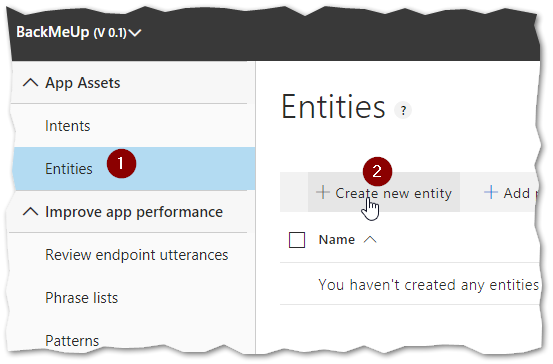
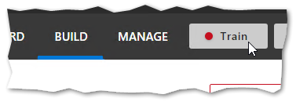
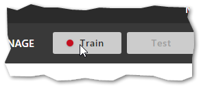

# Lab 3: LUIS Integration

## Abstract

The Language Understanding (LUIS) API allows you to take advantage of the deep learning capabilities of Azure’s Cognitive Services to incorporate natural language interactions into your bot. This lab focuses on configuring and integrating LUIS into our BackMeUp bot.

Upon completion, developers should have:

* Set up a LUIS application
* Connect the bot service to LUIS
* Manage synonyms with entities
* Use intents to tie utterances to dialogs or steps
* Test and release LUIS application using versions
* Continuously improve your LUIS app

## Module 1: Using Entities and Intents

### Exercise 1: Create a LUIS App

#### L3M1E1 Step 1

Navigate to https://www.luis.ai/home

#### L3M1E1 Step 2

If you’re not logged in, you’ll need to sign in


#### L3M1E1 Step 3

Click on “Create new app”


#### L3M1E1 Step 4

Type “BackMeUp” in the “Name” field and click “Done”


#### L3M1E1 Step 5

Click “BackMeUp” to open


### Exercise 2: Create a LUIS Entity

#### L3M1E2 Step 1

Click “Entities” and then “Create new entity”



#### L3M1E2 Step 2

Type “Command” for “Entity name” and “List” for “Entity type”. Then click “Done".


#### L3M1E2 Step 3

Under “Values” type “back pain” and hit enter


#### L3M1E2 Step 4

Your entry will appear below. Click “Synonyms” and type “back”. Hit “Enter”. Repeat for “lower back pain” and “upper back pain”.


### Exercise 3: Create LUIS Intent

#### L3M1E3 Step 1

Click “Intents” and then “Create new intent”


#### L3M1E3 Step 2

Type “Root Command” and click “Done”


#### L3M1E3 Step 3

In the text box under “Root Command”, type “help me with my back pain” and hit “Enter”


#### L3M1E3 Step 4

Note that this automatically identified the entity. This is because we added “back pain” to the entity’s list.


#### L3M1E3 Step 5

Add these utterances:

* “my back hurts”
* “I need help with my back”
* “can you help me with my back”
* “my back needs help”


#### L3M1E3 Step 6

Click “Train”



#### L3M1E3 Step 7

When it’s done training, click “Test”


#### L3M1E3 Step 8

Type “help me, my back hurts”. It should match up to “Root Command”


#### L3M1E3 Step 9

Click “Inspect”. The “Inspect” panel should expand. Note that the “Command” entity captures “back” as the entity value.


#### L3M1E3 Step 10

Click “Publish”


#### L3M1E3 Step 11

Keep the default “Environment” choice of “Production.” Click “Publish”


### Exercise 4: Connect Bot to LUIS

#### L3M1E4 Step 1

Open the solution used in Lab 2

#### L3M1E4 Step 2

Add the NuGet package “Microsoft.Bot.Builder.AI.Luis”


#### L3M1E4 Step 3

Open “BotConfiguration.bot” and paste in the following JSON at the end of the “services” array. Don’t forget the comma in the element above it.

``` json
{
  "type": "luis",
  "name": "BackMeUp",
  "appId": "",
  "version": "",
  "authoringKey": "",
  "subscriptionKey": "",
  "region": "",
  "id": "2"
}
```

#### L3M1E4 Step 4

Return to the LUIS portal

#### L3M1E4 Step 5

Click the “Manage” tab, then select “Application information”. Click the copy button next to the “Application ID” and paste it into the “appId” field in “BotConfiguration.bot”


#### L3M1E4 Step 6

Click “Versions” and take note of the version name. Type that in the “version” field in “BotConfiguration.bot”


#### L3M1E4 Step 7

Click “Keys and Endpoints”. Copy “Key 1” and past it into “subscriptionKey” in “BotConfiguration.bot”. Type the “Region” value into the “region” field in “BotConfiguraiton.bot”


#### L3M1E4 Step 8

In “ConfigureServices” within the “Startup.cs” file, locate the switch statement that inspects “service.Type”. Add the following code

``` csharp
case ServiceTypes.Luis:
    if (service is LuisService luisService)
    {
        services.AddSingleton(sp => new LuisApplication(
            luisService.AppId ?? throw new InvalidOperationException("The LUIS configuration must include appId property"),
            luisService.SubscriptionKey ?? throw new InvalidOperationException("The LUIS configuration must include subscriptionKey property"),
            luisService.GetEndpoint()));
        services.AddTransient(sp => new LuisRecognizer(
            sp.GetService<LuisApplication>(),
            new LuisPredictionOptions
            {
                IncludeAllIntents = true,
            }));
    }

    break;
```

#### L3M1E4 Step 9

Open up “BackMeUp.cs” and add the LuisApplication to the constructor, as a readonly field, and in the initialization code of the constructor body


#### L3M1E4 Step 10

In “BackMeUp.cs” add the private method code below

``` csharp
private static async Task ProcessCommandAsync(
    ITurnContext turnContext,
    RecognizerResult luisResult,
    DialogContext dialogContext,
    CancellationToken cancellationToken)
{
    var commands = luisResult?.Entities["Command"]?.ToObject<string[][]>();
    if (commands == null || commands.Length == 0 || commands[0].Length == 0)
    {
        var responseMessage = MessageFactory.Text(
            "We're here to help. Try typing \"help me with back pain\"");
        await turnContext.SendActivityAsync(responseMessage, cancellationToken);
        return;
    }

    var theCommand = commands[0][0];
    switch (theCommand)
    {
        case "back pain":
            await dialogContext.BeginDialogAsync(
                BackPainDialogFactory.DialogId,
                cancellationToken: cancellationToken);
            break;
        default:
            var responseMessage = MessageFactory.Text(
                "I'm sorry. I can't help you with that. Try typing \"help me with back pain\"");
            await turnContext.SendActivityAsync(responseMessage, cancellationToken);
            break;
    }
}
```

#### L3M1E4 Step 11

In “BackMeUp.cs” at the top of “OnTurnAsync” just below the line

``` csharp
if (turnContext.Activity.Type == ActivityTypes.Message)
{
```

add

``` csharp
var luisResult = turnContext.Activity.Text == null
    ? null
    : await _luis.RecognizeAsync(turnContext, cancellationToken);
var (luisIntent, _) = luisResult?.GetTopScoringIntent() ?? (null, 0.0);
```

#### L3M1E4 Step 12

In “BackMeUp.cs” replace the “else if” (and its body) that looks like this

``` csharp
else if (new[] { "back pain", "start" }.Any(t => t == activityText))
{
    // start the dialog. We'll do better when we integrate LUIS
    await dialogContext.BeginDialogAsync(
        BackPainDialogFactory.DialogId,
        cancellationToken: cancellationToken);
}
```

with this

``` csharp
else if (luisIntent == "Root_Command")
{
    await ProcessCommandAsync(turnContext, luisResult, dialogContext, cancellationToken);
}
```

#### L3M1E4 Step 13

Run and test in the Bot Framework Emulator

## Module 2: Continuous Improvement

### Exercise 1: Add Help Intent

#### L3M2E1 Step 1

In the LUIS portal, click “Intents” in the menu, and then “Create new intent”


#### L3M2E1 Step 2

Name it “Help” and click “Done”


#### L3M2E1 Step 3

Add the following utterances

Image | Utterance
---|---
 | <ul><li>What can you do</li><li>What can I do</li><li>I do not know what to do</li><li>I do not understand</li><li>Help me</li></ul>

#### L3M2E1 Step 4

Train and test your changes

#### L3M2E1 Step 5

Publish your changes


#### L3M2E1 Step 6

In “OnTurnAsync” in the “BackMeUp.cs” file, after

``` csharp
var (luisIntent, _) = luisResult?.GetTopScoringIntent() ?? (null, 0.0);
```

Add the lines

``` csharp
if (luisIntent == "Help")
{
    var message = MessageFactory.Text("Right now, I can only help you with back pain. With time, I'll do more, but try typing \"Help me with back pain\"");
    await turnContext.SendActivityAsync(message, cancellationToken);
    return;
}
```

#### L3M2E1 Step 7

Run your code and test your changes in Bot Framework Emulator

### Exercise 2: Versioning LUIS Applications

#### L3M2E2 Step 1

On the “Versions” tab, check the checkbox next to “0.1” then click “Clone”


#### L3M2E2 Step 2

Type “0.2” then click “Done”


#### L3M2E2 Step 3

You should now see a new version “0.2” that is the active version. This means edits made will be to version 0.2.


#### L3M2E2 Step 4

Change the active version back to “0.1” by clicking the checkbox next to “0.1” then clicking “Activate”


#### L3M2E2 Step 5

Switch between versions using the toggle at the top left. This has the same effect as step 4


#### L3M2E2 Step 6

While editing version “0.2”, return to the “Intents” screen on the “BUILD” tab. Click “Add prebuilt intent”


#### L3M2E2 Step 7

Type “AreYouListening” in the search box, click the checkbox next to “OnDevice.AreYouListening” and click “Done”


#### L3M2E2 Step 8

You should now see the prebuilt intent in your list of intents


#### L3M2E2 Step 9

Click “Train”



#### L3M2E2 Step 10

Click “Publish”


#### L3M2E2 Step 11

Select “Staging” then click “Publish”


#### L3M2E2 Step 12

In “appsettings.json”, add the following section

``` json
"LUIS": {
  "Staging": true
}
```

#### L3M2E2 Step 13

Update “ConfigureServices” in “Startup.cs”. Replace the LuisPredictionOptions initializer with the following

``` csharp
new LuisPredictionOptions
{
    IncludeAllIntents = true,
    Staging = Configuration.GetSection("LUIS").GetValue<bool>("Staging"),
}
```

#### L3M2E2 Step 14

Optionally, you can update the “version” in the “luis” service of “BotConfiguration.bot”. It locates your service by slot, not version number.

#### L3M2E2 Step 15

In “BackMeUp.cs” add the following code under the code that handles the “Help” intent

``` csharp
if (luisIntent == "OnDevice_AreYouListening")
{
    var message = MessageFactory.Text("Your well being is very important to me. I listen intently to everything you say.");
    await turnContext.SendActivityAsync(message, cancellationToken);
    return;
}
```

#### L3M2E2 Step 16

Run your code and test it using Bot Framework Emulator.

### Exercise 3: Improving Entities

#### L3M2E3 Step 1

Return to the “Entities” tab in LUIS, and select “Command”


#### L3M2E3 Step 2

Note that LUIS provides suggestions


#### L3M2E3 Step 3

You may see different options; pick one by clicking on it. Add a few more if you wish.


#### L3M2E3 Step 4

Train and publish to staging

#### L3M2E3 Step 5

In “ProcessCommandAsync” of “BackMeUp.cs”, replace the “default” code in the switch statement with the following

``` csharp
var responseMessage = MessageFactory.Text(
    $"I'll be able to help you with your {theCommand} soon. For now, I can only help with back pain.");
await turnContext.SendActivityAsync(responseMessage, cancellationToken);
break;
```

#### L3M2E3 Step 6

Run your code and test it using the Bot Framework Emulator

### Lab3 Module 2 Bonus Exercise 1

The code in these labs has evolved in a way that makes it easy to follow. To be maintainable, however, it needs some work. Try refactoring the code in “BackMeUp.cs” to help with maintainability.

### Lab3 Module 2 Bonus Exercise 2

You can see utterances that the endpoint received but was not able to match with an intent by clicking “Review endpoint utterances” in the “BUILD” tab. Take a look at the utterances you typed during testing. If you see one that can be matched to an intent, select the proper “Aligned intent” and then click the “Add to aligned intent” checkbox. Go back to “Intents” and observe what happened.

### Lab3 Module 2 Bonus Exercise 3

Read about phrase lists (https://docs.microsoft.com/en-us/azure/cognitive-services/luis/luis-how-to-add-features).