# BackMeUp Bot Lab

These labs are designed to help developers learn to create chat bots using the Microsoft Bot Framework and associated technologies. Upon completing the three labs, developers should understand:

* Bot Framework
  * Creating a new bot project
  * Configuring the bot
  * Integrating the bot into the .Net Core ecosystem
  * Build robust data collection using dialogs
* QnA Maker
  * Create a new knowledge base using the QnA Maker website
  * Integrate a bot with the QnA Maker API
  * Enhance the knowledge base with natural banter (chitchat)
* Language Understanding
  * Configure the Azure Language Understanding (LUIS) service to recognize intents
  * Incorporate entities into intents to collect data from natural language utterances  
  * Integrate a bot with LUIS
  * Respond to intents in the bot
  * Perform continuous improvement on the LUIS application

These labs use .Net Core 2.1 with the 4.x Bot Framework dependencies.

# Lab 1: Connect Bot to QnA Maker

## Abstract

In this lab, you will set up and run your first functional bot. It takes you beyond the basics by connecting your chat bot with a knowledge base deployed in Azure. Upon completion, developers should have:

* Installed the prerequisites to build a bot
* Learned the basics of a bot project
* Tested the bot using the Bot Framework Emulator
* Set up a knowledge base in Azure using the QnA Maker
* Tested the knowledge base on the QnA Maker website
* Exported and imported a knowledge base
* Integrated a bot application with the QnA Maker API

## Module 1: Set Up Tools

This module will walk you through the process of setting up the tools required to build and test your bot.

### Exercise: Install Visual Studio (Any Edition)

1) Navigate to https://visualstudio.microsoft.com/downloads/
1) Choose an edition of Visual Studio. For this lab, any edition will work. 
1) The download installs the installer (not Visual Studio itself). When the installer starts, select “ASP.NET and web development”, “Azure development”, and “.NET Core cross-platform development”. Click “Install”  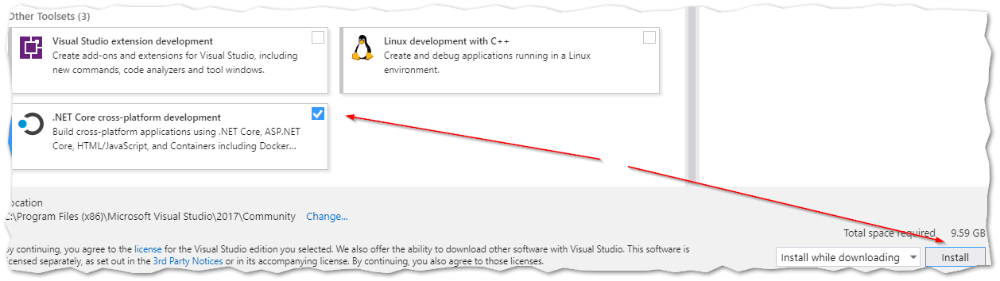
1) Wait 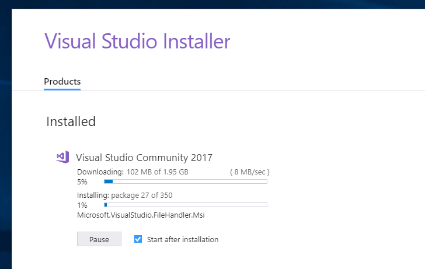
1) When it’s done, you’ll be asked to sign in. You can sign in or choose to do so later. Go ahead in sign in, because if you don’t do so now, you’ll have to do so in a few seconds.

### Exercise: Install Bot Framework Emulator

1) Close Visual Studio and the Visual Studio Installer
1) Navigate to https://github.com/Microsoft/BotFramework-Emulator/releases and install the latest version

### Exercise: Install Bot Framework Template for Visual Studio

1) Navigate to https://botbuilder.myget.org/gallery/aitemplates and choose the latest version of “Bot Builder SDK Template for Visual Studio” 
1) Download and install
1) Start Visual Studio (you should not need to restart Windows)

## Module 2: Create new Echo Bot Project

In this module, you will create and run a bot using the predefined templates provided to Visual Studio.

### Exercise: Create Basic EchoBot

1) Create a new project 
1) Create a new "Bot Builder Echo Bot V4" project 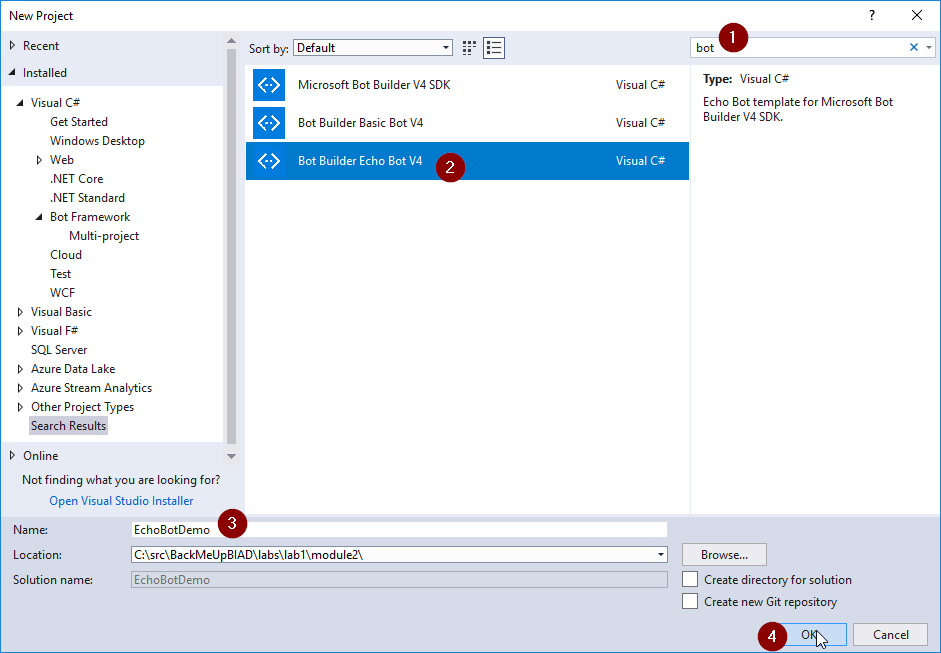
1) Start the project 

### Exercise: Connect to EchoBot and Test It

1) Start the Bot Framework Emulator
1) Click "Open Bot" 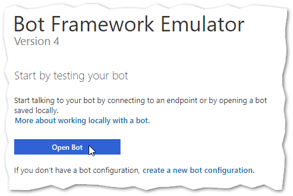
1) Select the BotConfiguration.bot file in the project you just created 
1) Type anything in the chat window. The EchoBot will respond by echoing back your message. 

### Lab1 Module 2 Bonus Exercise 1

Work with a partner to identify where the turn is being processed. Modify the code to respond “Polo” when “Marco” is typed.

### Lab1 Module 2 Bonus Exercise 2

Look at how EchoBotAccessors.cs works. Modify it to save the user’s name if they type “My name is [name]”

### Lab1 Module 2 Bonus Exercise 3

Modify the bot to respond “Hello, it’s nice to meet you” when the user types “hello”, but only the first time the user types “hello”. Double bonus if you have it include the user's name if provided in the previous bonus exercise.

## Module 3: Create a Knowledge Base in Azure

In this module, you will learn how to create and configure a knowledge base using the Microsoft QnA Maker. You will also create a bot from a blank project and connect it to the QnA Maker API to provide interactive knowledge base functionality.

### Exercise: Create QnA Service

1) Navigate to https://www.qnamaker.ai
1) If you have not signed in, do so now. 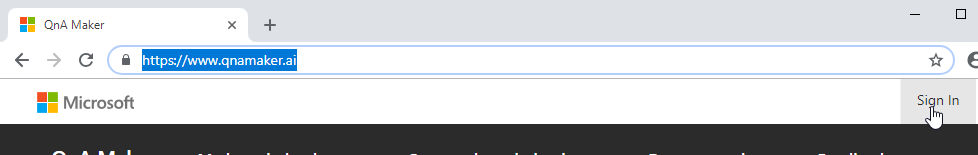
1) Click "Create a knowledge base" 
1) Create a QnA service in Azure  
    1) Name the service
    1) Choose a subscription (if you have more than one)
    1) Choose the location of the service
    1) Choose the tier (F0 is the free tier)
    1) Choose an existing, or create a new resource group
    1) Choose the Azure Search tier (F if the free tier)
    1) Choose a location for the search service
    1) Choose a globally unique name for the web application that will host the QnA service
    1) Choose a location for the web application
    1) Choose a location for Application Insights
    1) Create the service

### Exercise: Create a Knowledge Base

1) Navigate to www.qnamaker.ai, and refresh the page. You should now be able to select the QnA service 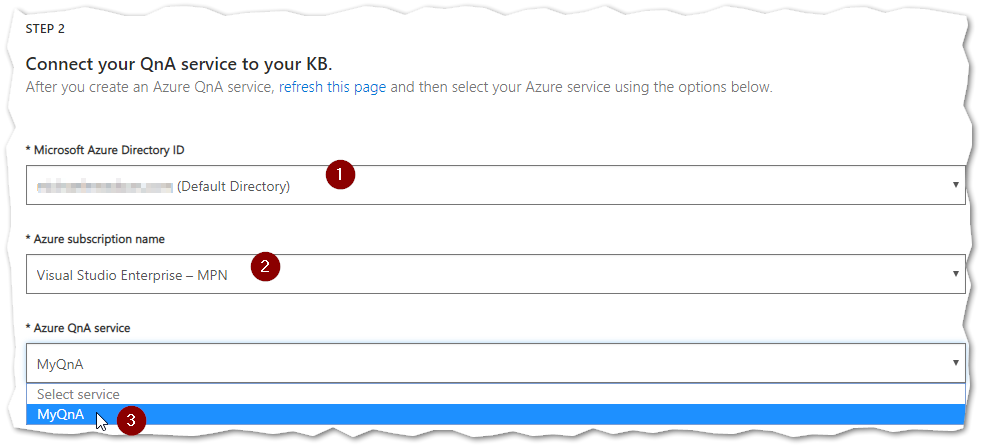
1) Name your KB. For this exercise, any name will do 
1) Skip "STEP 4". Click "Create your KB" in "STEP 5" 

### Exercise: Add Questions and Answers to Knowledge Base

1) Click "Add QnA pair" 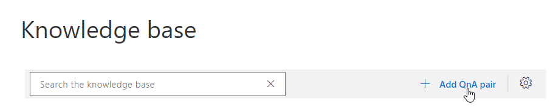
    1) Under "Question", type "what is your name" 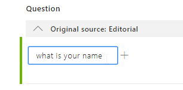
    1) Under "Answer", type "My name is HAL9000" 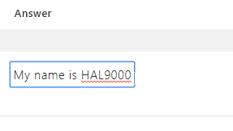
    1) Click "Save and train" at the top 
    1) Click "Test" 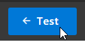
    1) Chat with HAL9000. Notice how he respects variations in your question 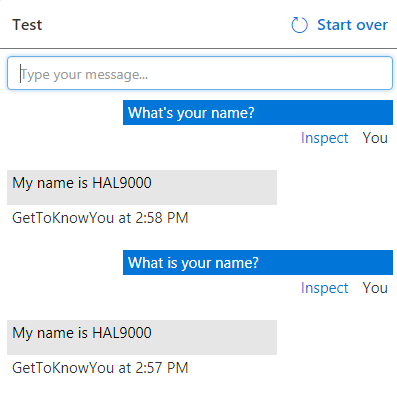
    1) Click "Inspect" to see how it interpreted your question 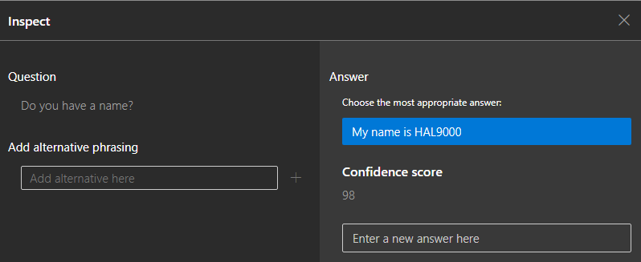
    1) When you're done, click "Test" again to hide the panel 

### Lab1 Module 3 Bonus Exercise 1

When inspecting the answer to “Do you have a name?” Have HAL9000 answer “Yes, I have a name. My friends call me HAL. You may call me HAL9000.”

### Lab1 Module 3 Bonus Exercise 2

